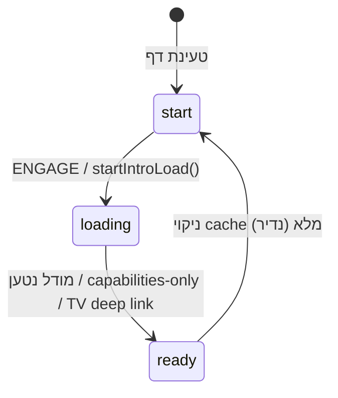

# GROVEEMODEL — דוח Handoff לממשק וארכיטקטורה

> **מטרה:** מסמך זה מאפשר להתחיל שיחה חדשה במחשב אחר ולהמשיך פיתוח בלי לאבד הקשר.  
> **עדכון אחרון:** 28 ביוני 2026 · commit `44cc412` על `main`

---

## 1. מיקום וקישורים

| פריט | ערך |
|------|-----|
| **נתיב מקומי** | `C:\Users\Avatar001\CascadeProjects\GROVEEMODEL` |
| **GitHub** | https://github.com/Theicd/GROVEEMODEL |
| **אתר חי (Pages)** | https://theicd.github.io/GROVEEMODEL/docs/ |
| **שורש redirect** | https://theicd.github.io/GROVEEMODEL/ → מפנה ל-`docs/` |
| **Dev מקומי** | `npm run dev` → http://127.0.0.1:5180/ (**לא** פורט 5173) |
| **Node** | ≥ 18.18 |

### איך להדביק לשיחה חדשה

```
אני ממשיך עבודה על GROVEEMODEL.
קרא את HANDOFF.md בשורש הריפו לפני שינויים.
Repo: C:\Users\Avatar001\CascadeProjects\GROVEEMODEL
Live: https://theicd.github.io/GROVEEMODEL/docs/
```

---

## 2. מבנה שורש הפרויקט

```
GROVEEMODEL/
├── app/                    # Vite root — כל קוד React/TS
│   ├── index.html          # HTML כניסה (dev/build)
│   └── src/                # ~6700 שורות App.tsx + מודולים
├── docs/                   # Bundle פרודקשן ל-GitHub Pages (לא לערוך ידנית!)
├── dist/                   # פלט vite build (מועתק ל-docs)
├── public/                 # סטטי: reality/, liveMedia/, games/, face models
├── scripts/                # build, sync, QA probes
├── vite.config.ts          # root=app, port 5180, aliases, proxies
├── vite-plugins/           # dev proxies (EPG, Tavily, OpenSERP, AIS)
├── companion/              # Grove Search Companion — installer Windows
├── GroVeeSerch/            # חבילת companion חלופית + config.yaml
├── desktop/                # GROVEE Desktop — Inno Setup
├── index.html              # redirect בלבד → docs/
├── package.json            # סקריפטים: dev, build, build:pages-docs
└── HANDOFF.md              # ← המסמך הזה
```

---

## 3. נקודות כניסה (Entry Points)

### `app/src/main.tsx`
- מתקין `installGlobalErrorHooks()` מ-`bootHelpers.ts`
- עוטף `App` ב-`StrictMode` + `ErrorBoundary`
- ב-dev: `window.__GROVEE_UI__ = "hal-space-v2"`

### `app/src/App.tsx` (~6700 שורות)
**המוח המרכזי** — phase UI, workers, chat, vision, panels, settings, persistence.

### Workers (Web Workers נפרדים!)
| Worker | קובץ | מודל |
|--------|------|------|
| Gemma | `app/src/model.worker.ts` | `onnx-community/gemma-4-E2B-it-ONNX` (~3.9GB) |
| SmolLM | `app/src/modelRack/textModel.worker.ts` | `PengZhang424242/SmolLM2-360M-Instruct-ONNX` (~220MB) |
| Summarizer | `app/src/summarizer.worker.ts` | סיכום חדשות |

**חשוב:** אל תערבב את שני ה-workers — Gemma לדסקטופ/ראייה, SmolLM לטקסט קל בנייד.

---

## 4. שלבי הממשק (UI Phases)

ה-phase **לא** נשמר ב-state — מחושב:

```typescript
const phase = isLoaded ? "ready" : isLoading ? "loading" : "start";
```

### דיאגרמת זרימה



### Phase: `start` / `loading` — מסך פתיחה (Intro)

**קומפוננטה:** `app/src/components/IntroScreen.tsx`

| אלמנט | קובץ | תפקיד |
|--------|------|--------|
| רקע HAL / כדור הארץ | `GroveeHudCanvas.tsx` | Canvas אנימציה |
| כפתור ENGAGE | `IntroEngageTab.tsx` | קורא `onLoad` → `startIntroLoad()` |
| פס עליון | `IntroTopBar.tsx` | WebGPU badge, גרסה |
| פוטר | `IntroMarqueeFooter.tsx` | SmolLM vs Gemma, מטמון, WASM retry |
| טבעת התקדמות | `CircularProgress.tsx` | אחוזי הורדה |
| מודל מידע | `GroveeInfoModal.tsx` | אודות / פרטיות |

**Props מרכזיים מ-App:**
- `onLoad={() => startIntroLoad()}`
- `onContinueWithoutChat={() => enterCapabilitiesOnlyMode()}`
- `startupTarget={bootTarget}` — `"gemma" | "local-text"`
- `showWasmRetry` — כש-WebGPU נכשל

### Phase: `ready` — אפליקציית הצ'אט

**מעטפת:** `#app-container` ב-`App.tsx` (שורה ~5927)

```
#app-container
├── .sidebar / .sidebar__rail     # תפריט צד (צ'אט חדש, חיפוש, TV, משחקים, גלובוס)
├── .chat-main                    # אזור הודעות + composer
│   ├── ChatLandingHeadline       # כשאין הודעות
│   ├── רשימת הודעות + ChatMarkdown
│   └── composer (prompt, attachments, ContextRing, mic)
├── פאנלים צדדיים (overlay / beside)
│   ├── LiveMediaPanel            # TV / רדיו / EPG
│   ├── GamesPanel                # משחקים
│   ├── GlobePanel                # מפה / reality iframe
│   ├── SearchResultsPanel        # תוצאות חיפוש מאוחדות
│   ├── ArtifactPanel             # קוד / מסמכים
│   └── VisionInspectorPanel      # ניתוח ראייה
├── SettingsModal (inline ב-App)   # Gemma, SmolLM, Vision, API keys
├── PluginsPanel                  # plugins + RSS engine
└── CameraPreview + HAL mood      # מצב מצלמה
```

### מצבים מיוחדים בתוך `ready`

| מצב | State | התנהגות |
|-----|-------|---------|
| **Capabilities-only** | `chatModelAvailability === "none"` | חיפוש, TV, משחקים, גלובוס — **בלי LLM** |
| **SmolLM chat** | `chatModelAvailability === "local-text"` | שיחה דרך `textModel.worker` |
| **Gemma chat** | `chatModelAvailability === "gemma"` | שיחה + ראייה דרך `model.worker` |
| **TV deep link** | `readTvDeepLink()` | `?tv=1` או `#tv` — פותח TV, מדלג על intro |
| **Camera / HAL** | `cameraMode` | מצלמה + vision pipeline |

---

## 5. בחירת מודל בפתיחה (Startup)

**קובץ:** `app/src/startupModelProfile.ts`

| פונקציה | סינכרוני? | תפקיד |
|---------|-----------|--------|
| `detectMobileDevice()` | כן | UA + `(pointer: coarse)` + רוחב < 900 |
| `quickStartupModelChoice("auto")` | **כן** | נייד → SmolLM, דסקטופ → Gemma (בלי המתנה ל-WebGPU) |
| `resolveStartupModelChoice("auto")` | לא | probe מלא: זיכרון, WebGPU adapter (timeout 2.5s) |
| `resolveLocalTextBootBackend()` | כן | **נייד → WASM תמיד** לפני הורדה |
| `recommendStartupModel()` | — | כללים: נייד / ≤4GB / אין WebGPU → SmolLM |

### מזהי מודל SmolLM

```typescript
// app/src/modelRack/localTextModels.ts
export const SMOLLM_HF_MODEL_ID = "PengZhang424242/SmolLM2-360M-Instruct-ONNX";
export const SMOLLM_RACK_ID = "hf--PengZhang424242--SmolLM2-360M-Instruct-ONNX";
export const LOCAL_TEXT_READY_KEY = "grovee_local_text_ready_v1";
```

---

## 6. זרימת טעינת מודל

### `startIntroLoad()` — לחיצה על ENGAGE

```typescript
// app/src/App.tsx
const startIntroLoad = () => {
  const pref = appSettingsRef.current.startupModel;
  const target = quickStartupModelChoice(pref);  // מיידי — לא מחכה ל-WebGPU
  setIsLoading(true);
  setBootTarget(target);
  // UI loading state מיד
  void resolveStartupModelChoice(pref).then((rec) => {
    setStartupRecommendation(rec);  // רק להמלצה / תצוגה
  });
  void (async () => {
    if (target === "local-text") await loadLocalTextBoot();
    else loadModel();  // Gemma worker
  })();
};
```

### `loadLocalTextBoot()` — SmolLM

**סדר קריטי (תיקון TDZ):** `backend` חייב להיות מוגדר **לפני** `bootLog`.

```typescript
const loadLocalTextBoot = async (opts?: { forceWasm?: boolean }) => {
  const lt = appSettingsRef.current.localText;
  const alreadyReady = readLocalTextReadyIds().includes(SMOLLM_RACK_ID);
  const backend = resolveLocalTextBootBackend(lt.inferenceBackend, opts);  // קודם!
  bootLog("SmolLM boot start", { forceWasm: !!opts?.forceWasm, backend, ... });
  // ...
  await downloadLocalTextModel(SMOLLM_RACK_ID, SMOLLM_HF_MODEL_ID, onProgress, backend);
};
```

**Runtime wrapper:** `app/src/modelRack/localTextModelRuntime.ts`
- `downloadLocalTextModel()` — Promise עם progress
- שגיאות load חייבות `scope: "load"` (לא `"chat"`) — אחרת נבלעות בשקט

### `loadModel()` — Gemma

- שולח ל-`workerRef` הודעה `{ type: "load", backend }`
- `backend` מ-`appSettings.inferenceBackend` או WASM forced
- WebGPU כשל → כפתור WASM retry ב-intro

### לוגים לדיבוג

```javascript
// בקונסול DevTools — סנן:
[GROVEE:boot]
```

קובץ: `app/src/inferenceBootLog.ts` — `bootLog`, `bootWarn`, `snapshotInferenceSettings()`

---

## 7. זרימת צ'אט (שליחת הודעה)

```
sendPrompt (submit טופס)
  │
  ├─ needsCapabilitiesPath? → runCapabilitiesOnlyTurn()
  │     └─ chatTurnPrelude: web search / games / globe / תשובות מוכנות
  │
  ├─ usesLocalText? → runLocalTextTurn()
  │     └─ prelude → prepareLocalTextTurnForModel (HE→EN) → generateLocalTextChat
  │
  ├─ usesExternalRack? → runRackModelTurn()  (מודלי ענן בתמונה)
  │
  └─ else → beginGeneration()  (Gemma)
        ├─ chatIntents.ts — ברכה, ראייה, קוד, topic shift...
        ├─ webSearch/ — חיפוש אם needsWebSearch
        ├─ characterPrompts.ts — system prompt
        └─ worker streaming tokens
```

### קבצי ניתוב מרכזיים

| קובץ | תפקיד |
|------|--------|
| `chatIntents.ts` | סיווג כוונות משתמש (pure functions) |
| `chatTurnPrelude.ts` | orchestration לפני LLM (חיפוש, משחקים, גלובוס) |
| `webSearch/index.ts` | מנוע חיפוש מאוחד (100+ providers) |
| `webSearch/intents.ts` | זיהוי כוונות חיפוש |
| `localTextSystemPrompt.ts` | system prompt קומפקטי ל-SmolLM (~900 תווים מקס) |
| `localTextTranslate.ts` | גשר עברית→אנגלית ל-SmolLM |
| `characterPrompts.ts` | system prompts ל-Gemma |
| `capabilitiesOnlyMode.ts` | מצב ללא מודל שיחה |

---

## 8. מובייל — התאמות ספציפיות

| קובץ | מה עושה |
|------|---------|
| `ui/useMobileKeyboardInset.ts` | CSS vars: `--app-height`, `--keyboard-inset` מ-`visualViewport` |
| `ContextRing.tsx` | מד חלון הקשר; popover מובייל: `context-popover--mobile` |
| `index.css` | `@media (max-width: 768px)` — composer מעל מקלדת |
| `startupModelProfile.ts` | SmolLM + WASM בנייד; `quickStartupModelChoice` בלי stall |

```typescript
// useMobileKeyboardInset.ts
const keyboardInset = Math.max(0, window.innerHeight - vv.height - vv.offsetTop);
root.style.setProperty("--app-height", `${Math.round(vv.height)}px`);
root.style.setProperty("--keyboard-inset", `${Math.round(keyboardInset)}px`);
```

---

## 9. localStorage — מפתחות חשובים

| מפתח | תוכן |
|------|------|
| `grovee_model_settings_v1` | הגדרות: Gemma, SmolLM, vision, startup model, inference backend |
| `grovee_chats_v1` | סשני צ'אט מרובים |
| `grovee_model_rack_v2` | מודלים ב-rack |
| `grovee_selected_model_v1` | מודל נבחר |
| `grovee_local_text_ready_v1` | SmolLM שהורד בהצלחה |
| `grovee-webgpu-blocked` | `"1"` אם WebGPU נכשל — fallback ל-WASM |
| `grovee_plugin_search_companion_url` | URL ל-Grove Search Companion |
| `grovee_capabilities_welcome_dismissed` | session — toast מצב יכולות |

---

## 10. פאנלים ומודולים נוספים

### TV / Live Media
- `liveMedia/LiveMediaPanel.tsx` — hub ראשי
- `liveMedia/CableTunerView.tsx` — טיונר + OSD
- `liveMedia/epg/` — EPG (XMLTV, MJH, TMDB meta, HLS cue sync)
- `public/liveMedia/curatedFavorites.json` — ערוצים מועדפים
- Deep link: `app/src/deepLinks.ts` — `?tv=1`, `#tv`

### Plugins
- `plugins/PluginsPanel.tsx` — hub: plugins, API keys, RSS
- `plugins/search-companion/` — health poll ל-OpenSERP מקומי (פורט 7000)

### Grovee News (מנוע חדשות)
- `groveeNews/engine/` — vendored מ-reality-core
- `groveeNews/boot.ts` — boot ברקע
- `groveeNews/bridge.ts` — גשר לצ'אט

### Globe / Reality
- `GlobePanel.tsx` + `realityGlobe/`
- iframe: `public/reality/` (מסונכרן מ-reality-core)

### Vision / Camera
- `GroveeVisionRunner.ts` — לולאת ראייה
- `vision2/` — HAL mood, live vision brief
- `cameraMode.ts`, `cameraSession.ts`

---

## 11. Build ו-Deploy ל-GitHub Pages

### פקודות

```bash
npm run dev              # פיתוח — http://127.0.0.1:5180
npm run build            # tsc + vite → dist/ (לא מספיק ל-Pages!)
npm run build:pages-docs # ← זה מה שצריך לפרודקשן
```

### מה `build:pages-docs` עושה (`scripts/build-pages-docs.mjs`)

1. `VITE_BASE=./` + `vite build` → `dist/`
2. `build-rss-cache.mjs` → `dist/rss-cache.json`
3. מוחק `docs/` ומעתיק `dist/` → `docs/`
4. מסנכרן `public/liveMedia/` → `docs/liveMedia/`
5. `prune-docs-assets.mjs` — bundle יחיד, מוחק assets ישנים

### דחיפה ל-GitHub

```bash
git add app/src/...           # שינויי קוד
git add -f docs/              # docs ב-gitignore — חובה -f!
git commit -m "..."
git push origin main
```

### מבנה URLs ב-Pages

| URL | מה נטען |
|-----|---------|
| `/GROVEEMODEL/` | `index.html` → redirect ל-docs |
| `/GROVEEMODEL/docs/` | `docs/index.html` → `./assets/index-*.js` |
| `/GROVEEMODEL/docs/tv.html` | כניסה ישירה ל-TV |
| `/GROVEEMODEL/tv.html` | redirect ל-docs/tv.html |

**אחרי push:** המתן 1–2 דקות + **נקה cache** בטלפון לפני בדיקה.

---

## 12. תיקונים אחרונים (חשוב לדעת)

### באג TDZ — `Cannot access 'et' before initialization` (תוקן ב-`0dd80de`)

- **תסמין:** מודל אדום בנייד מיד בלחיצת ENGAGE
- **סיבה:** `bootLog({ backend })` לפני `const backend = ...` ב-`loadLocalTextBoot`
- **תיקון:** העברת הגדרת `backend` לפני `bootLog`

### SmolLM נתקע בנייד (סדרת תיקונים `899b197`–`9a75f43`)

1. שגיאות worker ב-load השתמשו ב-`scope: "chat"` → נבלעו → תוקן ל-`scope: "load"`
2. `startIntroLoad` חיכה ל-WebGPU probe → תוקן עם `quickStartupModelChoice` סינכרוני
3. נייד: WASM לפני הורדה; timeout 2.5s ל-`requestAdapter`
4. system prompt קומפקטי ל-SmolLM (היה ~93% מהקונטקסט)
5. מקלדת מובייל + context popover כיוון נכון

### Commits אחרונים על main

```
44cc412 fix(pages): add rebuilt docs bundle after TDZ fix
0dd80de fix(mobile): SmolLM boot crashed — backend used before declaration
9a75f43 fix(mobile): SmolLM load errors were swallowed
d11ff9e fix(mobile): unblock SmolLM download start on phones
899b197 fix(mobile,smollm): keyboard, context popover, compact prompts
```

---

## 13. מפת קבצים — 60+ קבצים חשובים

### ליבה
| קובץ | שורה אחת |
|------|----------|
| `app/src/App.tsx` | אורקסטרטור מרכזי — phase, workers, chat, panels |
| `app/src/main.tsx` | bootstrap React |
| `app/src/index.css` | סגנונות גלובליים + מובייל |
| `app/src/intro-theme.css` | ערכת נושא HAL-space למסך פתיחה |
| `app/src/ErrorBoundary.tsx` | תפיסת שגיאות React |
| `app/src/bootHelpers.ts` | hooks לשגיאות גלובליות |

### Intro UI
| קובץ | שורה אחת |
|------|----------|
| `components/IntroScreen.tsx` | מסך פתיחה מלא |
| `components/IntroEngageTab.tsx` | כפתור ENGAGE |
| `components/IntroMarqueeFooter.tsx` | פוטר + SmolLM/Gemma label |
| `components/IntroTopBar.tsx` | פס עליון intro |
| `components/CapabilitiesWelcomeToast.tsx` | toast מצב ללא מודל |
| `GroveeHudCanvas.tsx` | canvas רקע intro |
| `hooks/useIntroCinematicSequence.ts` | רצף אנימציה |
| `hooks/useIntroFooterCarousel.ts` | קרוסלת פוטר |

### מודלים
| קובץ | שורה אחת |
|------|----------|
| `model.worker.ts` | Worker Gemma |
| `modelRack/textModel.worker.ts` | Worker SmolLM |
| `modelRack/localTextModelRuntime.ts` | API download/generate SmolLM |
| `modelRack/localTextModels.ts` | IDs + ready state |
| `modelRack/localTextModelSettings.ts` | הגדרות SmolLM |
| `modelRack/modelRack.ts` | rack persistence |
| `startupModelProfile.ts` | בחירת מודל בפתיחה |
| `inferenceBootLog.ts` | לוגי `[GROVEE:boot]` |

### צ'אט
| קובץ | שורה אחת |
|------|----------|
| `chatIntents.ts` | סיווג כוונות |
| `chatTurnPrelude.ts` | prelude לפני LLM |
| `chatMarkdown.tsx` | רינדור markdown |
| `characterPrompts.ts` | prompts ל-Gemma |
| `localTextSystemPrompt.ts` | prompt קומפקטי SmolLM |
| `localTextTranslate.ts` | תרגום HE→EN |
| `ContextRing.tsx` | מד חלון הקשר |
| `contextUsageEstimate.ts` | הערכת tokens |
| `chatHardwareProfile.ts` | פרופילי context (Ultra/Safe/Low) |

### חיפוש ויכולות
| קובץ | שורה אחת |
|------|----------|
| `webSearch/index.ts` | כניסה למנוע חיפוש |
| `webSearch/searchPlanner.ts` | תכנון חיפוש |
| `webSearch/intents.ts` | כוונות חיפוש |
| `capabilitiesOnlyMode.ts` | מצב ללא LLM |
| `searchResults/index.ts` | פאנל תוצאות |
| `gameSearch/` | חיפוש משחקים |
| `realityGlobe/intents.ts` | כוונות גלובוס |

### מדיה חיה
| קובץ | שורה אחת |
|------|----------|
| `liveMedia/LiveMediaPanel.tsx` | פאנל TV/רדיו |
| `liveMedia/CableTunerView.tsx` | טיונר + OSD |
| `liveMedia/epg/epgService.ts` | שירות EPG |
| `liveMedia/epg/mjhSources.ts` | מקורות XMLTV |
| `liveMedia/epg/hlsCueSync.ts` | סנכרון HLS cues |
| `tmdb/tmdbLocalize.ts` | לוקליזציה TMDB לעברית |
| `deepLinks.ts` | `?tv=1` deep link |

### Plugins / API
| קובץ | שורה אחת |
|------|----------|
| `plugins/PluginsPanel.tsx` | hub פלאגינים |
| `plugins/search-companion/` | Grove Search Companion |
| `apiKeys/apiKeyStore.ts` | מפתחות API (Tavily, TMDB, AIS...) |

### Vision
| קובץ | שורה אחת |
|------|----------|
| `GroveeVisionRunner.ts` | לולאת ראייה |
| `vision2/halMoodEngine.ts` | מצב רוח HAL |
| `cameraMode.ts` | הפעלת מצלמה |
| `documentIngest.ts` | PDF/DOCX/תמונות |

### Build / Config
| קובץ | שורה אחת |
|------|----------|
| `vite.config.ts` | קונפיג Vite |
| `scripts/build-pages-docs.mjs` | publisher ל-Pages |
| `scripts/sync-grovee-news.mjs` | sync מנוע חדשות |
| `docs/index.html` | entry פרודקשן (hashed assets) |

---

## 14. מגבלות וכללי עבודה לסוכן קוד

1. **`App.tsx` הוא המרכז** — שינויי UI גדולים כמעט תמיד עוברים דרכו.
2. **אל תערוך `docs/assets/*.js` ידנית** — תמיד `npm run build:pages-docs`.
3. **נייד ≠ דסקטופ למודל:** בחירת SmolLM בנייד; Gemma בדסקטופ חזק. WASM ל-SmolLM בנייד (נפרד מבחירת מודל).
4. **Capabilities-only מכוון** — אל תשבור חיפוש/TV/משחקים כשאין מודל.
5. **שני workers נפרדים** — אל תמזג Gemma ו-SmolLM.
6. **מינימום scope** — אל תשבור imports (רגרסיות עבר: `LIVE_MEDIA_CATEGORIES`, `CapabilitiesWelcomeToast`).
7. **TDZ:** לעולם אל תשתמש ב-`const` לפני ההגדרה שלו — במיוחד ב-`bootLog`.
8. **Worker errors:** load → `scope: "load"`, chat → `scope: "chat"`.

---

## 15. Checklist אימות

- [ ] `npm run dev` → http://127.0.0.1:5180 — intro HAL + ENGAGE
- [ ] דסקטופ: ENGAGE → הורדת Gemma (~3.9GB)
- [ ] נייד / emulation: ENGAGE → SmolLM progress (סנן `[GROVEE:boot]`)
- [ ] צ'אט פשוט → streaming tokens
- [ ] שאילתת חיפוש → פאנל תוצאות / תשובה חיה
- [ ] אייקון TV → `LiveMediaPanel`
- [ ] `?tv=1` → פותח TV ישירות
- [ ] `npm run build:pages-docs` → `docs/assets/index-*.js` מתעדכן
- [ ] https://theicd.github.io/GROVEEMODEL/docs/ אחרי push + ניקוי cache

---

## 16. עבודה לא גמורה / המשך אפשרי

- וידוא SmolLM מוריד ועובד על Android Chrome אחרי תיקון TDZ
- שינויים EPG/TV שלא נדחפו (קבצים modified ב-working tree: `liveMedia/epg/`, `tmdb/`)
- ביטול/החלפת PAT ששותף בצ'אט — השתמש ב-`gh auth login`
- בדיקות `npm test` — יש שגיאות TS בקבצי test/webSearch (לא חוסם vite build)

---

*נוצר אוטומטית ל-handoff בין מחשבים. עדכן תאריך ו-commit כשממשיכים עבודה משמעותית.*
