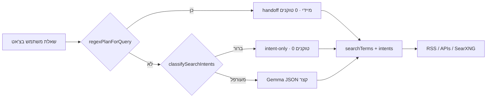

# תרחישי חיפוש AI → מנוע — GROVEE

> **מטרה:** לבדוק מה המשתמש שואל בצ'אט מול מה הממשק שולח למנועי החיפוש — בלי תשובות ארוכות מהמודל.

## זרימה



## Handoff מינימלי

הפונקציה `resolveSearchHandoff(query)` מחזירה:

| שדה | משמעות |
|-----|--------|
| `routing` | `regex` · `intent-only` · `planner` |
| `searchTerms` | עד 3 מונחים למנוע (אנגלית לחדשות RSS) |
| `intents` | אילו APIs להפעיל |
| `panelMode` | `topics` או `search` (חדשות) |

**JSON למודל (רק כש-`planner`):**

```json
{"queries":["robotics trends"],"answerShape":"overview","useWebFallback":true}
```

אין intents ב-JSON — הם נקבעים בקוד. אין הסברים — רק מונח חיפוש אחד.

## הרצה אוטומטית

```bash
npm test -- app/src/webSearch/aiSearchRoutingQa.test.ts
```

קטלוג: `app/src/webSearch/aiSearchQueryScenarios.ts` — **40+ תרחישים**.

## בדיקה ידנית

1. הפעל `npm run dev` · סמן **Search**
2. העתק שאילתה מהטבלה למטה
3. אשר: פאנל ימין · בלוקי מקורות · `searchTerms` הגיוניים

### חדשות — סקירה (Topics)

| ID | שאילתה | צפוי |
|----|--------|------|
| AI-N01 | מה קורה בעולם? | Topics · blend RSS |
| AI-N04 | מה קורה בישראל? | Topics ישראל |
| AI-N05 | ספר לי חדשות היום בבקשה | דיגסט יומי |

### חדשות — ניסוח מורכב (Search)

| ID | שאילתה | מונח מנוע |
|----|--------|-----------|
| AI-N10 | שמעתי משהו על איראן וגרעין… | iran |
| AI-N11 | יש משהו חדש עם טסלה… | tesla |
| AI-N14 | מה המצב הביטחוני בעזה? | gaza |

### נושאים טכנולוגיים (multi-source)

| ID | שאילתה | מקורות |
|----|--------|--------|
| AI-T01 | מה קורה בעולם הרובוטיקה? | HN+GitHub+arXiv+RSS |
| AI-T02 | מה חדש בעולם הגיימינג? | HN+GitHub+RSS |
| AI-T03 | מה חדש בתחום הבינה המלאכותית? | HN+GitHub+HF |

### נתונים חיים

| ID | שאילתה | API |
|----|--------|-----|
| AI-W03 | מה מזג האוויר בתל אביב | Open-Meteo |
| AI-A01 | כמה מטוסים מעל ישראל? | ADSB |
| AI-S01 | איפה תחנת החלל עכשיו? | ISS |
| AI-F04 | מה מחיר הביטקוין? | CoinGecko |

### Planner (מודל קצר)

| ID | שאילתה | הערה |
|----|--------|------|
| AI-P01 | מה המגמות החמות בטכנולוגיה השנה? | JSON בלבד · SearXNG fallback |
| AI-G01 | מחפש פרויקט קוד פתוח לזיהוי פנים | GitHub · תרגום לחיפוש |

### פערים ידועים (ניסוח שיחה)

| ID | שאילתה (לא עובדת היום) | חלופה שעובדת |
|----|------------------------|--------------|
| GAP-N01 | שמעתי משהו על איראן וגרעין… | חפש חדשות על איראן וגרעין |
| GAP-N02 | יש משהו חדש עם טסלה… | חפש חדשות על טסלה |
| GAP-N03 | מה השמועות על OpenAI… | חדשות על OpenAI |
| GAP-N04 | מה המצב הביטחוני בעזה? | חדשות על עזה |

יעד: planner JSON קצר שמחלץ `iran` / `tesla` / `gaza` בלי מילת «חדשות».

## קשור

- `acceptanceQueries.ts` — בדיקות live ל-APIs
- `newsAcceptanceQueries.ts` — חדשות בצ'אט
- `newsTopicAcceptanceQueries.ts` — «חפש חדשות בנושא…»
