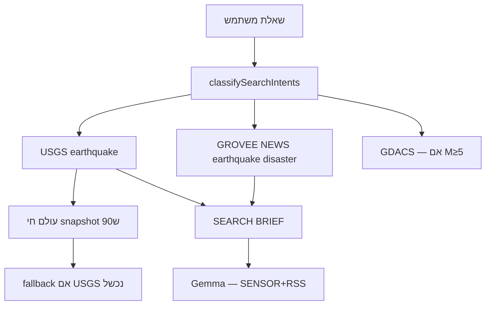

# נתונים חיים — בדיקות handoff (עולם חי + חיישנים + RSS)

> **אוטומטי:** `npm test -- app/src/webSearch/liveDataHandoffQa.test.ts`  
> **ידני:** סמן Search → שלח שאילתות מהטבלה

## זרימה — רעידות אדמה



## מה המודל מקבל (קומפקטי)

```
ANSWER (earthquake): M6.2 · Japan · …
SENSOR+RSS: USGS = חיישן; NEWS = מדיה
ANSWER (news): [BBC] … · [Reuters] …
LIVE WORLD: רעידות · תעופה · ספינות · ISS
```

## שאילתות בדיקה

| ID | שאילתה | צפוי |
|----|--------|------|
| LD-EQ02 | האם היו רעידות… מעל 5 בסולם ריכטר? | USGS M≥5 + RSS + GDACS |
| LD-EQ03 | איפה הרעידה החזקה בעולם ב-24ש? | החזקה ביותר · לא סינון שגוי |
| LD-EQ04 | רעידה בישראל השבוע? | סינון Israel/Dead Sea |
| LD-EQ05 | מה קורה באזור רעידה? יש חדשות? | חיישן + כותרות RSS |

## עולם חי — היסטוריה

- `warmLiveWorldCache()` — כל 90ש מושך USGS/ISS/AIS/ADS-B
- `ingestGlobeLivePayload()` — הגלובוס שולח עדכונים חיים
- `getCachedLiveWorldSnapshot()` — TTL 90ש · משמש fallback לחיפוש

## קשור

- `liveDataQueryScenarios.ts` — 11 תרחישים
- `liveDataHandoff.ts` — `resolveLiveDataHandoff(query)`
- `AI_SEARCH_SCENARIOS.md` — ניתוב כללי
